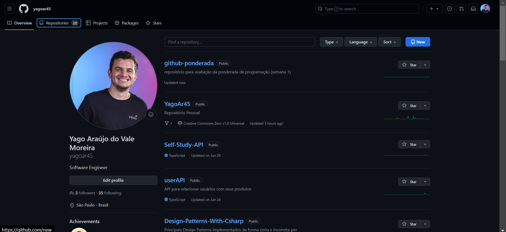
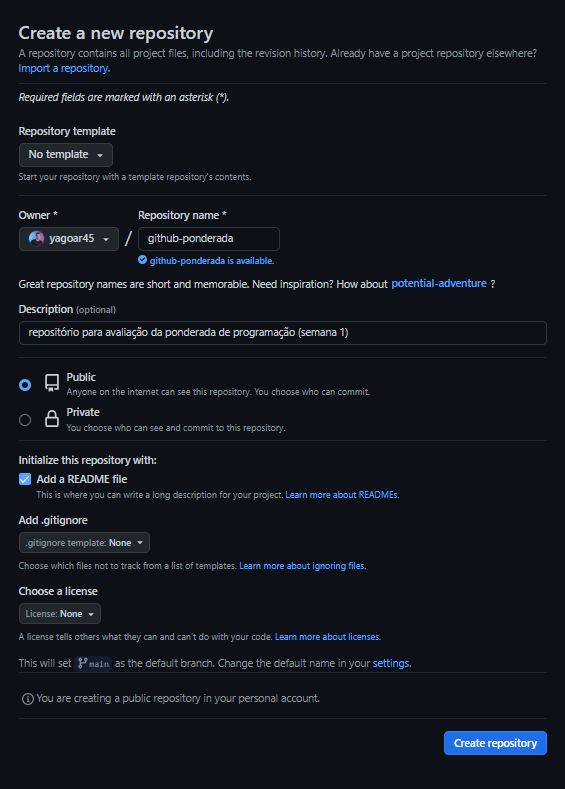
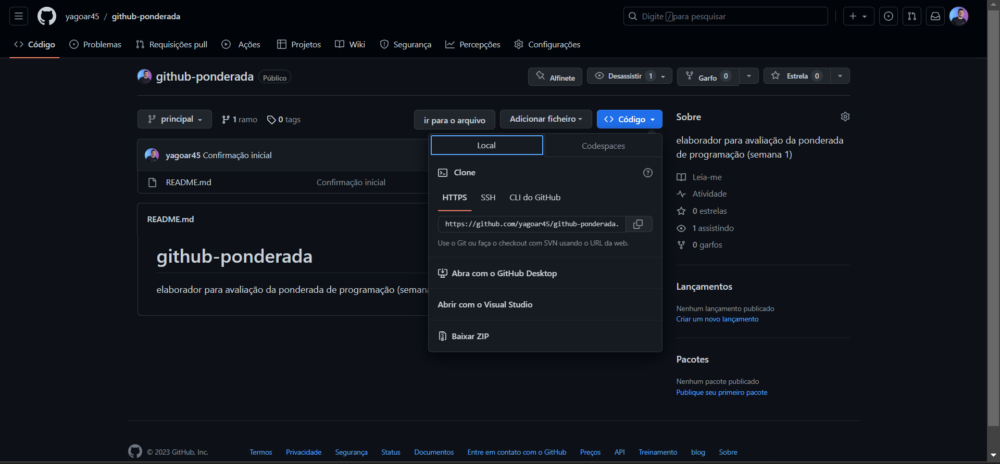

# github-ponderada
repositório para avaliação da ponderada de programação (semana 1)

## Introdução
* Essa atividade servirá como relatório do tutorial git/github da semana 1.

* Nele, será mostrado o passo a passo para trabalhar com git e github na prática.

* Os conceitos abordados serão: 
    *  GitHub Get Started
    *  GitHub Edit Code 
    * Pull from GitHub
    * Push to GitHub 
    * GitHub Branch 
    * Pull Branch from GitHub
    * Push Branch to GitHub.
   

## Github Get Started 

* Para começarmos, iremos na conta do github e iniciaremos um novo repositório clicando em "new".



## 
* Agora, atribuiremos um nome para o repositório no campo ```Repository name``` e também uma descrição no campo ```Description```

* Atribuiremos o tipo ```Public``` para que todos tenham acesso.

* Por fim, criaremos um README genérico preenchendo a checkbox ```Add a README file``` e clicaremos em ```Create Repository```



### Push Local Repository to GitHub

* Para executaremos o push local, primeiro devemos copiar a seguinte url do repositório:



* Depois disso, colocaremos a url no ```git bash``` específico da pasta onde queremos salvar o acesso

* Em seguida, rodaremos o seguinte comando: ```git remote add origin <url_copiada>```


* Agora, atualizaremos o repositório local através do comando: 
```git pull origin main```

* Por fim, faremos o push na CLI do ```git bash``` por meio desse comando: ```git push --set-upstream origin main```


