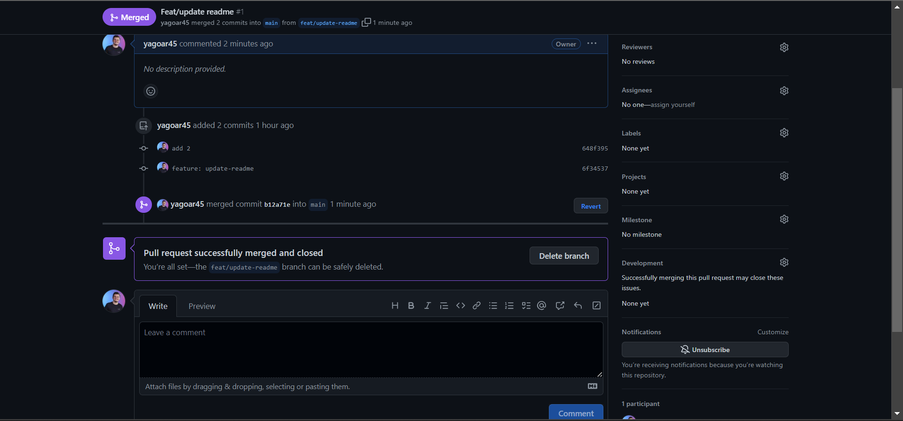

# github-ponderada
repositório para avaliação da ponderada de programação (semana 1)


## Introdução
* Essa atividade servirá como relatório do tutorial git/github da semana 1.

* Nele, será mostrado o passo a passo para trabalhar com git e github na prática.

* Os conceitos abordados serão: 
    *  GitHub Get Started
    *  GitHub Edit Code 
    * Pull from GitHub
    * Push to GitHub 
    * GitHub Branch 
    * Pull Branch from GitHub
    * Push Branch to GitHub.
   

## Github Get Started 

* Para começarmos, iremos na conta do github e iniciaremos um novo repositório clicando em "new".


## 
* Agora, atribuiremos um nome para o repositório no campo ```Repository name``` e também uma descrição no campo ```Description```

* Atribuiremos o tipo ```Public``` para que todos tenham acesso.

* Por fim, criaremos um README genérico preenchendo a checkbox ```Add a README file``` e clicaremos em ```Create Repository```


### Push Local Repository to GitHub

* Para executaremos o push local, primeiro devemos copiar a seguinte url do repositório:


* Depois disso, colocaremos a url no ```git bash``` específico da pasta onde queremos salvar o acesso

* Em seguida, rodaremos o seguinte comando: ```git remote add origin <url_copiada>```


* Agora, atualizaremos o repositório local através do comando: 
```git pull origin main```

* Por fim, faremos o push na CLI do ```git bash``` por meio desse comando: ```git push --set-upstream origin main```


* Finalmente, repositório estará atualizado


## Github Edit Code

* Além de ser uma rede social com repositórios git, o github também possui um editor de código. Para fazer isso no README, basta clicar no lápis da tela inicial


* Adiconaremos uma mudança simples no readme e depois commitaremos a mudança no próprio github. 


## Pull from GitHub

* Para trabalhar em um time de desenvolvimento, é importante que todos os membros da equipe estejam atualizados.

* No git, para trazer as alterações mais recentes do código, você utilizar o ```git pull <remote> <branch>```


* O ```git pull <remote> <branch>``` é a combinação desses dois comandos: ```fetch``` e  ```merge```

* ```fetch``` traz todas as alterações históricas de uma branch/repositório


* ```merge``` combina as branchs passadas como parâmetro na linha de comando 


* Caso você queira somente atualizar o repositório, sem passar por essas etapas, use o  ```git pull <remote> <branch>```


## Push to GitHub

Para fazer o push via git, devemos seguir esses passos:

* fazer alguma alteração

* rodar o comando: ```git commit -a -m "<descrição>"``` 


* Verificar o estado do código com o comando ```git status```


* Por fim, iremos rodar o comando: ```git push```


## GitHub Branch

* Para criar uma nova branch no github, vá até o repositório, click em "main", adicione um nome e aperte em: ```Create Branch```


* Agora, mudamos a branch para ```develop```. Essa mudança pode ser verificada ao ver que o "main" alterou para "develop"


## Pull Branch From GitHub

* agora, atualizaremos o nosso git local com a alteração feita, no caso, a criação da branch develop.


* Para fazer a conexão de atualização da branch no github com a local, faremos o checkout da main para a develop e depois rodaremos o comando ```git pull```


* Agora, podemos ver que há uma nova branch no git local por meio do comando: ```git branch```


## Push a Branch to GitHub

* Agora, faremos o processo inverso: criaremos uma branch no git local e a subiremos para o github.

* Para isso, primeiro, iremos fazer o checkout da branch atual e criaremos outra 


* Agora, faremos as devidas alterações e logo após, o processo tradicional: adicionar, commitar e fazer o push


* Após isso, a branch e a sua atualização já estará no github.

* Por fim, abriremos um pull request e aceitaremos o pedido de merge


* Para evitar que o repositório fique muito complexo, iremos deletar essa branch recem criada, já que o seu código já foi mergiado 



* No final, teremos isso na tela principal:

